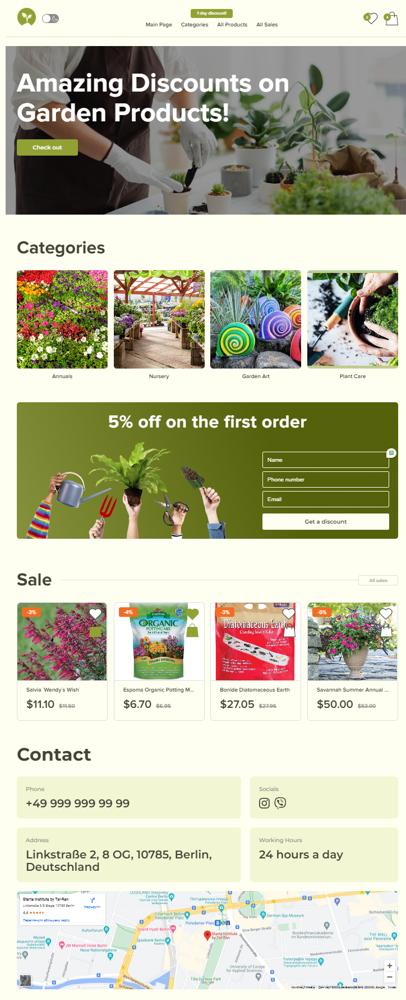

# Getting Started with Create React App

This project was bootstrapped with [Create React App](https://github.com/facebook/create-react-app).

## Available Scripts

In the project directory, you can run:

### `npm start`

Runs the app in the development mode.\
Open [http://localhost:3000](http://localhost:3000) to view it in your browser.

The page will reload when you make changes.\
You may also see any lint errors in the console.

#### Project theme

Online store of goods for gardening and home.

##### Link to technical specifications

https://docs.google.com/document/d/1-d-txMvn4pGiZ2p7eL-f4I2iy2EBqjZN/edit?usp=sharing&ouid=106808451092815483562&rtpof=true&sd=true

###### Link to FIGMA design

https://www.figma.com/file/SDNWLzCWkh9ZXdCpWEaByv/project-frontend?type=design&node-id=280-1136&mode=design&t=NJTGdloftvn8I6Vz-0

###### Link to deploy realization

https://code-crafters-sandy.vercel.app

###### Project Description

The Web-app for an online store selling home and garden products. The site should provide users with a convenient interface to view products, categorize them, add them to the cart, and complete orders.

##### Project tree

https://miro.com/app/board/uXjVKERpOpw=/?moveToWidget=3458764592733521094&cot=14

###### Technology stack

JavaScript: Used as the primary programming language to develop the frontend logic of the application due to its wide support and versatility in web development.

React: Chosen as the frontend library for building user interfaces, enabling the creation of reusable UI components and facilitating efficient rendering of dynamic data.

Redux: Utilized for managing the application's global state, ensuring centralized data management across components and enabling predictable state changes.

React-router-dom: Implemented for client-side routing within the React application, enabling navigation between different views or pages without a full page reload.

React-hook-form: Integrated to handle form validation and management in React components, providing a straightforward and efficient way to validate user input.

React-modal: Used to create and manage modal dialogs within the application, improving user experience by displaying content or actions in a focused overlay without leaving the current page.

Redux-persist: Implemented for persisting Redux state in the browser's local storage, ensuring state persistence across sessions and page reloads for enhanced user experience.

Redux-thunk: Employed as a middleware for Redux to handle asynchronous actions, enabling Redux to manage side effects such as API calls and dispatching multiple actions based on asynchronous results.

Axios: Utilized for making HTTP requests from the client-side to interact with the backend API, handling asynchronous data fetching and updating operations seamlessly.

##### Project DEVELOPERS

Kostiantyn Kryvorotov
Liudmyla Oldenburg
Diana Tsymbaliuk

